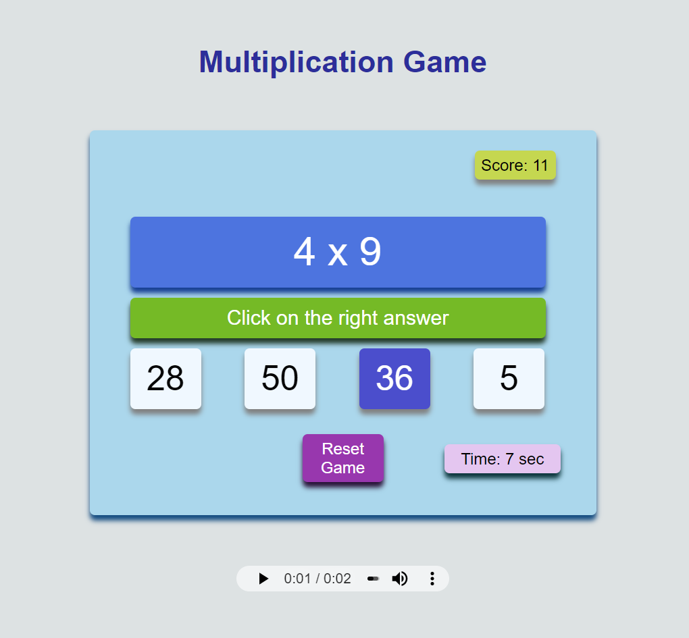
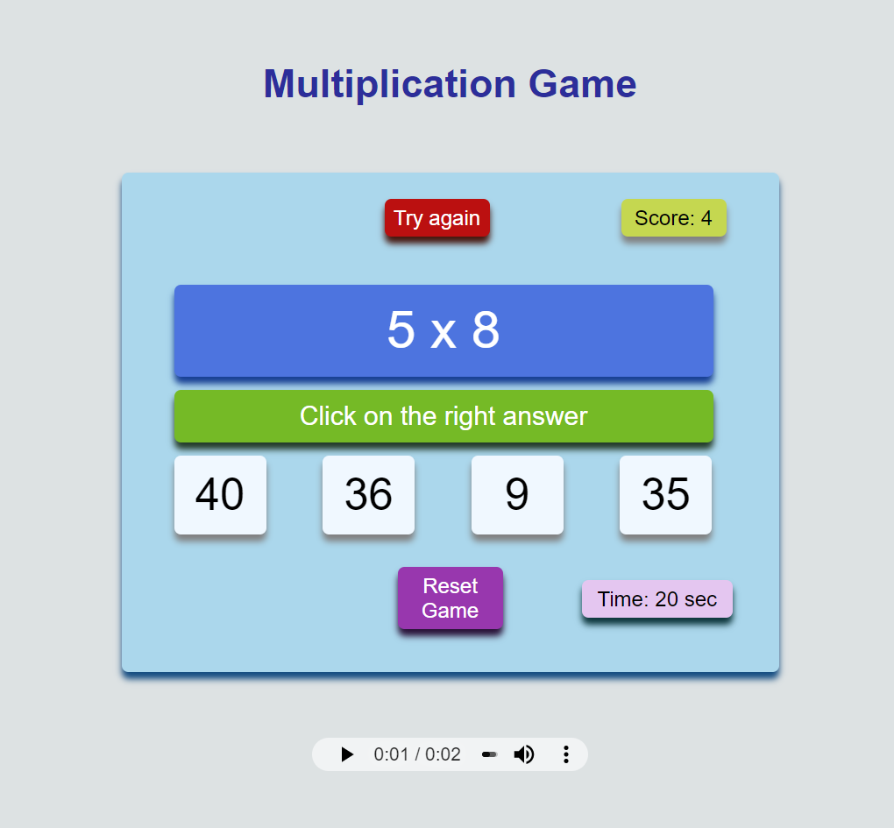
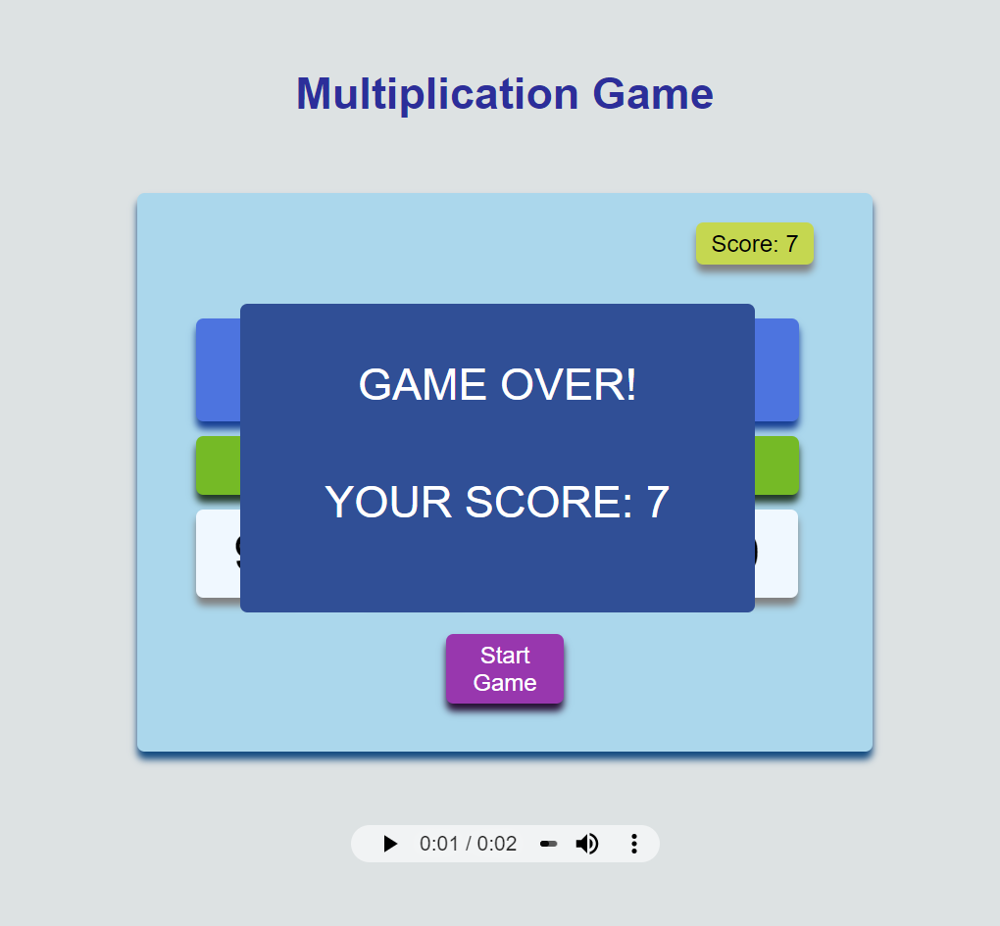
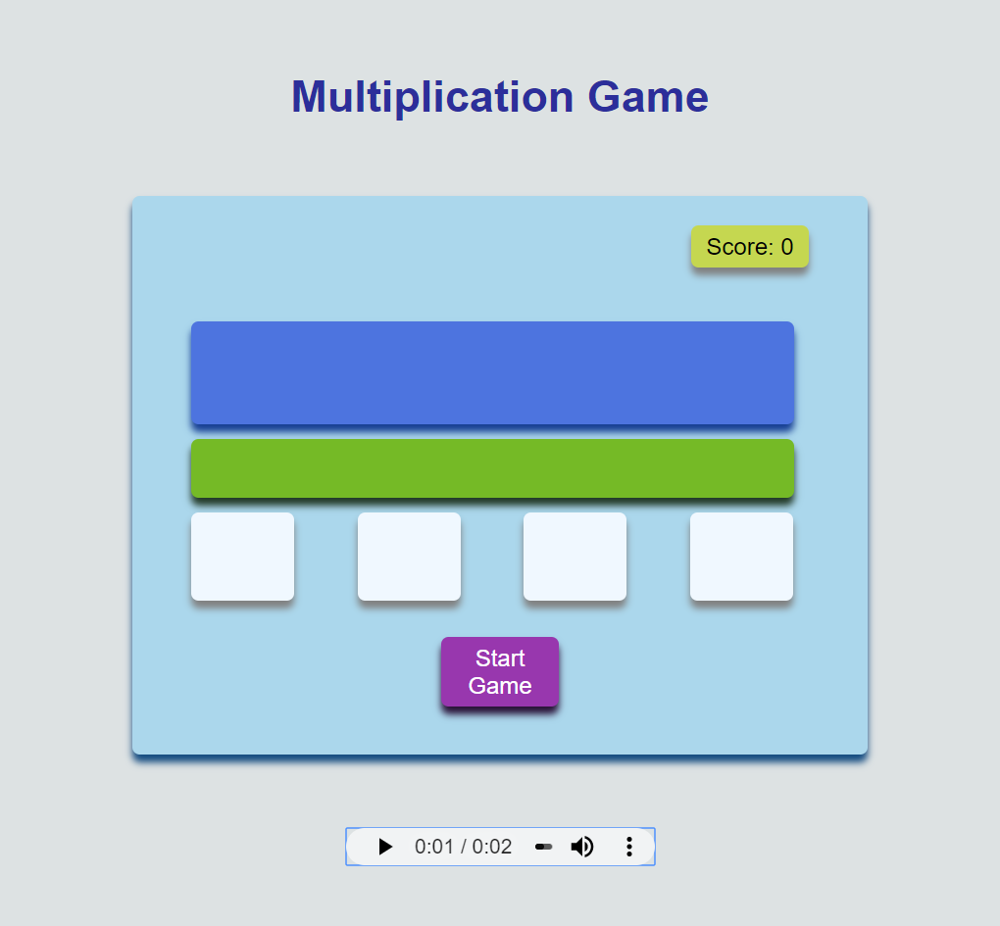

# MultiplicationGame
### Interactive application built with JavaScript

## Description
  ##### The main purpose of the project was to build an interactive application - Multiplication Game. The game demonstrates programming with JavaScript.

## Developing Tools:
  ###      </ul>
   ## Features:
   
    When the game begins, the timer is set to 30 seconds.
    <li>Two random numbers between 0 and 10 are displayed for the multiplication question.</li>
    <li>Four answer choices are given, one of which is the correct answer.</li>
    <li>If the correct answer is selected, the "right" label will be shown for one second, and a new question will be displayed.</li>
    <li>If an incorrect answer is selected, the "wrong" label will be shown for one second, and the question remains the same.</li> 
    <li>The score window updates the number of correct answers.</li>                        
    <li>The player can reset and restart the game at any time.</li>
    <li>The game includes music sounds (start, wrong, correct, gameover) for creating a playful athmosphere.</li>
    <li>After the time is out, the gameover window is displayed with the total score.</li>
   </ul>  

